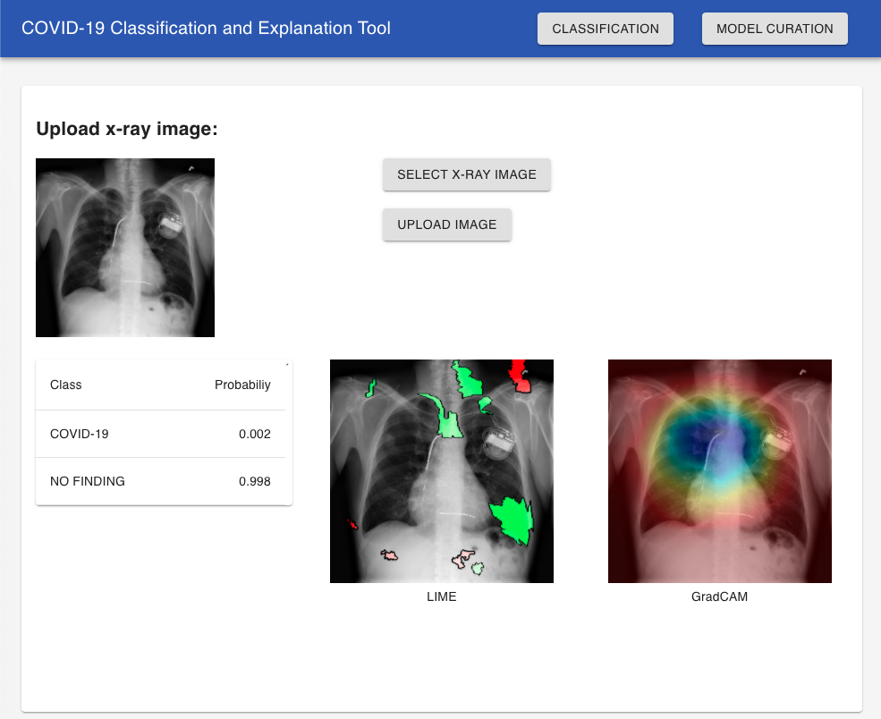

# covid-19-classification

## Code Status
[](https://standardjs.com)

## Overview
This work showcases a binary classifier for chest X-ray images which distinguishes between COVID-19 and no finding (healthy) using a convolutional neural network. Additionally, both LIME- and GradCAM-explainer are integrated into a web interface.



## Prerequisites
- ```python3``` and ```node.js```
- a set of x-ray images
- a trained model for covid-19 classification (see [Training](##training))
- a model for segmentation of the lungs (```trained_model.hdf5``` from https://github.com/imlab-uiip/lung-segmentation-2d)

## Install
```
pip install -r requirements.txt
npm install
cd src/frontend
npm install
```

## Training

The training of the classification model is performed from a jupyter notebook. The notebook contains further documentation for the training steps and necessary datasets and models.

See [covid_19_classification.ipynb](./covid_19_classification.ipynb).

## Usage

The application is divided into a backend and a frontend. 

The backend consists of python workers which perform classifications and explanations of chest x-ray images. The API itself is written in javascript (node.js) and merely forwards requests to a python worker (```server.py```) which starts a thread for each classification/explanation task. The communication between the API and the python worker uses the standard input/output streams and is structured as follows:
- A request for a method, e.g. classification containing a x-ray image payload is send to the corresponding endpoint, e.g. ```POST /v1/classifier```.
- The node.js API (```index.js```) validates the request, stores the image on disk and assigns a unique identifier to it.
- The node.js API send a single line to the ```stdin``` of the ```server.py```-process consisting of: ```METHOD ID``` e.g. ```classify f00091ff-cb7a```.
- The ```server.py```-process starts a thread for the specific task and prints ```METHOD ID RESULT``` on stdout once the task finishes.
- Finally, the API can answer the HTTP-request. 

The ```server.py```-process is initialized on startup and kept running for the entire lifecylce of the API-process.

The frontend is based on react.js.

1. Start the backend/API:
    ```
    $ node src/index
    usage: index [-h] -c MODEL_PATH -s SEGMENTATION_MODEL_PATH --cache-dir-path
                CACHE_DIR_PATH [--disable-api-cache]
                [--api-cache-lifetime API_CACHE_LIFETIME] [-p PORT] [-ip HOST]

    Covid-19 Classification API

    optional arguments:
      -h, --help            show this help message and exit
      -c MODEL_PATH, --model-path MODEL_PATH
                            path to classification model
      -s SEGMENTATION_MODEL_PATH, --segmentation-model-path SEGMENTATION_MODEL_PATH
                            path to segmentation model (U-Net)
      --cache-dir-path CACHE_DIR_PATH
                            path to cache dir
      --training-dir-path TRAINING_DIR_PATH
                            path to training queue dir
      --disable-api-cache   path to cache dir
      --api-cache-lifetime API_CACHE_LIFETIME
                            api cache lifetime in minutes
      -p PORT, --port PORT  api port
      -ip HOST, --host HOST
                            api host
    ```

    ```--model-path```: **required**, contains the path to the ```CNN``` / classification model<br>
    ```--segmentation-model-path```: **required**, contains the path to the ```U-Net```, which is used to perform segmentations of the lungs prior to classification.<br>
    ```--cache-dir-path```, **required**, contains the path to a cache directory. Some tasks such as segmentation need a directory where artifacts such as masks can be stored. The path needs to point to a (arbitrary) writeable directory.<br>
    ```--training-dir-path```, **required**, contains the path to a training directory. In order to store new training images, which can be uploaded via the web-interface, a directory is needed. The path needs to point to a (arbitrary) writeable directory.<br>
    ```--disable-api-cache```, _optional_, use this flag to disable the api cache. Usually, identical requests (e.g. classification of the same image) are resolved using a cache.<br> 
    ```--api-cache-lifetime```, _optional_, default: _5 minutes_, use this parameter to chance the lifetime of the cache entries.<br>
    ```--port```, _optional_, default: _3000_, change the port of the api.<br>
    ```--host```, _optional_, default: _localhost_, change the host of the api.<br>
2. Start the frontend:
    ```
    cd src/frontend
    npm start
    ```

## Python worker interface
Internally, the ```node.js```-API starts the python worker and organizes the communication. Hence, there is no need to directly access it. However, it can be used to perform a set of classifications and explanations on many images. The interface is structured as follows and the parameters are a subset of the API-parameters. 
The parameters provide the model files and the actual tasks are provided via stdin.

```
$ ./src/server.py
usage: server.py [-h] -c MODEL_PATH -s SEGMENTATION_MODEL_PATH
                 --cache-dir-path CACHE_DIR_PATH

Covid-19-Classification Server

The server accepts messages in the form of
"command image_id" e.g. "explain_lime f00091ff-cb7a"
on stdin. Once a command finished, the server
replies with the same message on stdout, 
followed by optional response parameters.
Allowed message types are: "classify", 
"explain_lime" and "explain_gradcam". 

The images have to be located in
"CACHE_DIR_PATH/IMAGE_ID.png".

optional arguments:
  -h, --help            show this help message and exit
  -c MODEL_PATH, --model-path MODEL_PATH
                        path to classification model
  -s SEGMENTATION_MODEL_PATH, --segmentation-model-path SEGMENTATION_MODEL_PATH
                        path to segmentation model (U-Net)
  --cache-dir-path CACHE_DIR_PATH
                        path to cache dir

```


A single image can be classified using:
```
echo "classify f00091ff-cb7a" | ./src/server.py -c data/model20200905-193900.h5 -s data/trained_model.hdf5 --cache-dir-path cache
```

## Attributions
Icon made by [Freepik](https://www.flaticon.com/de/autoren/freepik) from [www.flaticon.com](https://www.flaticon.com/de/)